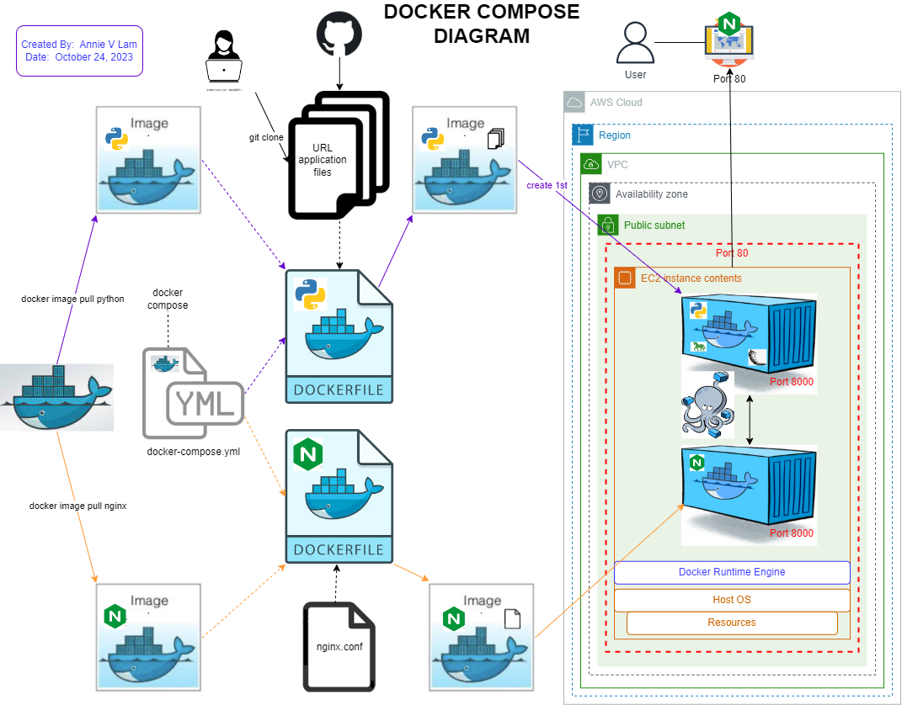

# Docker_Compose_Diagram

October 24, 2023

By:  Annie V Lam - Kura Labs

## Diagram

## Are Dockerfile and Docker Compose declarative or imperative?

Dockerfiles is imperative, the execution of the instructions in the Dockerfile in the order it appears 

Docker Compose is declarative.  The order of services listed in the docker-compose.yml file is not important, what is important is if there is a "depends_on:" clause.   If there is no "depends_on:" clause in the file, then the order of containers created is not important.  However, if there is a "depends_one" clause, the container that the service block depends on must be created first.  
